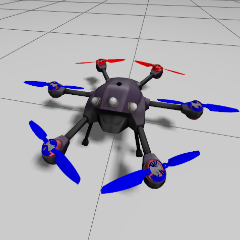
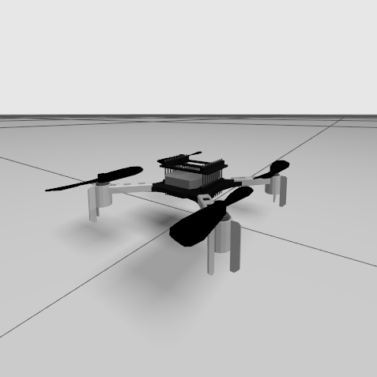
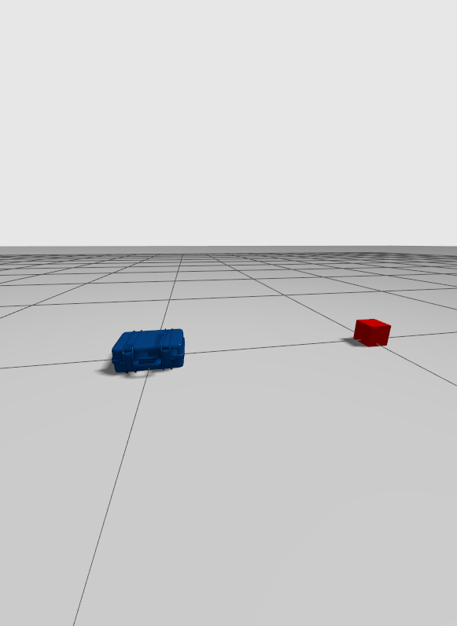

# as2_gazebo_assets

Colletion of AS2 Gazebo assets and launching scripts. 

Tested on **Gazebo Fortress**. Make sure to have it [installed](https://gazebosim.org/docs/fortress/install_ubuntu).

Gazebo naming has changed between ROS2 Galactic and ROS2 Humble releases [(Gazeno new era)](https://discourse.ros.org/t/a-new-era-for-gazebo-cross-post/25012). You should use *as2_gazebo_assets* package version corresponding to your ROS2 version.

## INDEX
- [INDEX](#index)
- [RESOURCES](#resources)
  - [DRONE MODELS](#drone-models)
  - [SENSOR MODELS](#sensor-models)
  - [WORLD MODELS](#world-models)
- [HOW TO RUN: Basic usage](#how-to-run-basic-usage)
  - [OPTIONS](#options)
  - [CONFIG FILE](#config-file)
- [EXAMPLES](#examples)
---

## RESOURCES
There are distinguish three kinds of reources: drone, sensor and world models.

### DRONE MODELS
<details>
<summary>Drone model list.</summary>
    
| SDF Name | Status | Image |
| - | :-: | - |
| *quadroto_base* | <span style="color:darkgreen">FLYING</span> |  |
| *hexrotor_base* | <span style="color:darkgreen">FLYING</span> |  |
| *crazyflie* | <span style="color:red">UNSTABLE FLYING</span> |  |
</details>

### SENSOR MODELS
<details>
<summary>Sensor model list.</summary>
    
| SDF Name | Description | Plugin |
| - | - | - |
| *imu* | **NOT SDF**: Alreay included in drone models. IMU sensor reports vertical position, angular velocity and linear acceleration readings. | ignition::gazebo::systems::Imu |
| *air_pressure* | Air pressure sensor reports vertical position and velocity readings. | ignition::gazebo::systems::AirPressure |
| *magnetometer* | **NOT SDF**: Alreay included in drone models. Magnetometer sensor reports the magnetic field in its current location. | ignition::gazebo::systems::Magnetometer |
| *hd_camera* | RGB Camera with 1280x960 resolution. | - |
| *vga_camera* | RGB Camera with 640x480 resolution. | - |
| *semantic_camera* | RGB Camera with 1280x960 resolution with semantic segmentation data. | - |
| *rgbd_camera* | RGBD Camera with 640x480 resolution and 10 meters of depth sensing. | - |
| *point_lidar* | Single point lidar with 40 meter range. | - |
| *planar_lidar* | Planar scanning two-dimension lidar with 30 meter range. | - |
| *3d_lidar* | Three-dimensional scan with 100 meter range. | - |
| *gps* | Navigation satellite sensor reports position and velocity in spherical coordinates (latitude / longitude). | ignition::gazebo::systems::NavSat |
| *suction_gripper* | Light weight suction gripper. | mbzirc::SuctionGripperPlugin |
</details>

### WORLD MODELS
<details>
<summary>World model list.</summary>
    
| SDF Name | Description | Image |
| - | - | - |
| *empty* | Empty world with ground. |  |
| *test_gripper* | Empty world with two small objects to test the gripper. |  |
| *empty_gps* | Empty world with ground and gps enabled |  |
</details>

## HOW TO RUN: Basic usage

Previously setting AS2 environment, simply run:
```bash
ros2 launch as2_gazebo_assets launch_simulation.py config_file:=<config-file>
```

This will run for you **ign gazebo server**, spawn all **models** from your config file and open **ign gazebo client** (GUI).

### OPTIONS

- **config_file**:
    Launch config file (JSON or YAML format).

- **gui_config_file**:
    GUI config file.
    (default: '')

- **use_sim_time**:
    Deactivates clock bridge and object publishes tf in sys clock time. Valid choices are: ['true', 'false']
    (default: 'true')

- **headless**:
    Launch in headless mode (only ign server). Valid choices are: ['true', 'false']
    (default: 'false')

- **verbose**:
    Launch in verbose mode. Valid choices are: ['true', 'false']
    (default: 'false')

- **run_on_start**:
    Run simulation on start. Valid choices are: ['true', 'false']
    (default: 'true')


### CONFIG FILE
Using a config file lets you to set the simulation environment. You can select a world (or none) and attach to it a number of desired drones with desired model, position and set of sensors (payload). Also, you can add objects with desired joints or brigdes to the world. Please pay atention to the format file, otherwise it may fail.

JSON file template:
```
{
    "world": "<world-name>",                // optional: deafult world if empty
    "drones": [                             // optional: no drones if empty
        {
            "model_type": "<model-name>",       // optional: default model if empty
            "model_name": "<namespace>",        // optional: default namespace if empty
            "xyz": [<x>, <y>, <z>],             // optional: [0, 0, 0] if empty
            "rpy": [<roll>, <pitch>, <yaw>],    // optional: [0, 0, 0] if empty
            "flight_time": <min>,               // optional: 0 or empty means not use battery
            "payload": [                        // optional: no sensors if none
                {
                    "model_type": "<sensor-type>",   // REQUIRED if sensor is used
                    "model_name": "<sensor-name>",   // REQUIRED if sensor is used
                    "xyz": [<x>, <y>, <z>],          // optional: [0, 0, 0] if empty
                    "rpy": [<roll>, <pitch>, <yaw>], // optional: [0, 0, 0] if empty
                },
                {
                    // Second sensor...
                }
            ]
        },
        {
            // Second drone...
        }
    ],
    "objects": [                            // optional: no objects if empty
        {    
            "model_name": "<object-name>",      // REQUIRED if object used
            "model_type": "<object-type>",      // REQUIRED if object used
            "xyz": [<x>, <y>, <z>],             // optional: [0, 0, 0] if empty
            "rpy": [<roll>, <pitch>, <yaw>],    // optional: [0, 0, 0] if empty
            "joints": ["<joint>"],              // optional: [] if empty
            "object_bridges": ["<bridge>"],     // optional: [] if empty
            "tf_broadcaster": <true/false>,     // optional: true if empty
            "use_sim_time": <true/false>        // optional: true if empty
        },
        {
            // Second object...
        }
    ]
}
```
Notice that comments are not available in JSON format and fields between "<" and ">" should be replaced with each value or removed (along with the field) if is not wanted or required.

Example of a valid JSON config file:
```json
{
    "world_name": "empty_gps",
    "drones": [
        {
            "model_type": "quadrotor_base",
            "model_name": "drone_sim_0",
            "xyz": [ 0.0, 0.0, 0.3 ],
            "payload": [
                {
                    "model_type": "gps",
                    "model_name": "gps"
                },
                {
                    "model_type": "hd_camera",
                    "model_name": "hd_camera"
                }
            ]
        }
    ],
    "objects": [
        {    
            "model_type": "windmill",
            "model_name": "windmill_0",
            "xyz": [ 15.0, 0.0, 0.3 ],
            "rpy": [ 0, 0, -1.57 ],
            "joints": ["motor_link_joint", "blades_link_joint"],
            "object_bridges": ["pose"]
        }
    ]
}
```

## EXAMPLES
Several examples can be found on [test](/tests) folder.
